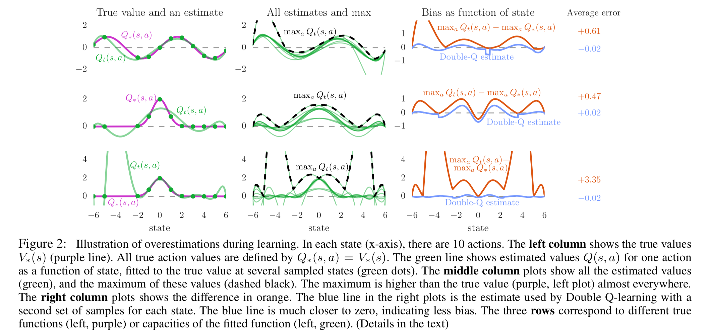
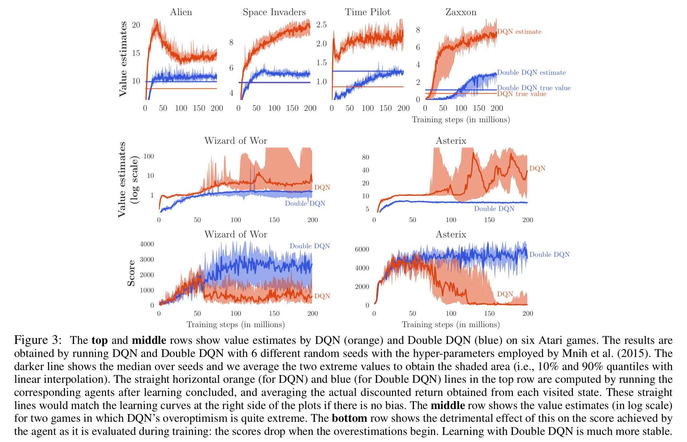

# Deep Reinforcement Learning with Double Q-learning

> 🤖 Flappy Bird hack using Deep Reinforcement Learning with Double Q-learning

## Requirements

```
numpy
torch
moviepy
pygame
ple
```

## Description

In this project, we will attempt to implement the algorithm developed by Google DeepMind's [Hado van Hasselt](https://hadovanhasselt.com/about/), [Arthur Guez](http://www.gatsby.ucl.ac.uk/~aguez/) and [David Silver](http://www0.cs.ucl.ac.uk/staff/d.silver/web/Home.html) in their paper about ["Deep reinforcement learning with double q-learning"](https://arxiv.org/abs/1509.06461). In this paper, authors tackled the overestimation implications of deep q-learning algorithm. In particular, they have presented the existence of DQN (Deep Q-Network) overestimation via some selected games in Atari 2600. To reduce such overestimation problem, this paper introduces **'Double Deep Q-learning Algorithm'** which is presented in tabular settings and could be generalized to work with large-scale function approximation settings. This paper concludes the much better overall performance by presented algorithm.


## Paper Summary

1. Background

    1. **Deep Q Networks**  
    DQN overcomes unstable learning by mainly 4 techniques.

        1. **Experience Replay**: Experience Replay stores experiences including state transition, rewards and actions, which are necessary data to perform Q learning, and makes mini-batches to update neural networks

        2. **Target Network**: In TD (Temporal Difference) error calculation, target function is changed frequently with DNN. Unstable target function makes training difficult. So Target Network technique fixes parameters of target function and replaces them with the latest network every thousand steps.

        3. **Clipping Rewards**: Each game has different score scales. For example, in Pong, players can get `1` point when winning the play. Otherwise, players get `-1` point. However, in Space Invaders, players get 10~30 points when defeating invaders. This difference would make training unstable. Thus Clipping Rewards technique clips scores, which all positive rewards are set `+1` and all negative rewards are set `-1`.

        4. **Skipping frames**: Arcade Learning Environment is capable of rendering `60` images per second. But actually people don't take actions so much in a second. AI doesn’t need to calculate Q values every frame. So Skipping Frames technique is that DQN calculates Q values every `4` frames and use past `4` frames as inputs. This reduces computational cost and gathers more experiences.

    1. **Double Q-learning**: The max operator in standard Q-learning and DQN, uses the same values both to select and to evaluate an action. This makes it more likely to select overestimated values, resulting in over-optimistic value estimates. To prevent this, we can decouple the selection from the evaluation. This is the idea behind Double Q-learning.

2. **Overoptimism** due to estimation errors: Thrun and Schwartz (1993) gave a concrete example in which Q-learning's overestimations even asymptotically lead to suboptimal policies, and showed the overestimations manifest themselves in a small toy problem when using function approximation. Later van Hasselt (2010) argued that noise in the environment can lead to overestimations even when using tabular representation, and proposed Double Q-learning as a solution.

    

3. **Double DQN**: The idea of Double Q-learning is to reduce overestimations by decomposing the max operation in the target into action selection and action evaluation. Although not fully decoupled, the target network in the DQN architecture provides a natural candidate for the second value function, without having to introduce additional networks. The authors therefore propose to evaluate the greedy policy according to the online network, but using the target network to estimate its value. In reference to both Double Q-learning and DQN, the authors refer to the resulting algorithm as Double DQN.

    

4. **Empirical Results**
    1. Results on Overoptimism
    2. Quality of the learned policies
    3. Robustness to Human starts


## Project Goal

- **Minimum Goal**: Implement the method proposed in the paper and test it on an Atari game. Eg. verify the algorithm on ping-pong, etc.
- **Maximum Goal**: Implement this algorithm on a new environment (Eg. a new game simulator) and propose certain ad-hoc modifications for achieve better performance.


## Environment configuration

For our project, we are planning to implement the proposed algorithm on ATARI 2600 games which is available at [PyGame Learning Environment](https://pygame-learning-environment.readthedocs.io/en/latest/). Additional resources are also available at Pygame and PyPi community. A particular simulator environment, that our team is interested in - **"Flappy Bird"**, is available [here](https://github.com/ntasfi/PyGame-Learning-Environment).


## Experiment results

### Agent preview


<table class="tg">
  <tr>
    <td class="tg-c3ow"></td>
    <td class="tg-c3ow"></td>
    <td class="tg-c3ow"></td>
  </tr>
  <tr>
    <td class="tg-c3ow">Best Agent</td>
    <td class="tg-c3ow">Risky Play</td>
    <td class="tg-c3ow">Bad Training</td>
  </tr>
</table>


### Loss and Average Reward

<p align="center">
  
</p>


## References

[1] Hado van Hasselt, Arthur Guez and David Silver. [*"Deep Reinforcement Learning with Double Q-learning"*](https://arxiv.org/abs/1509.06461)

